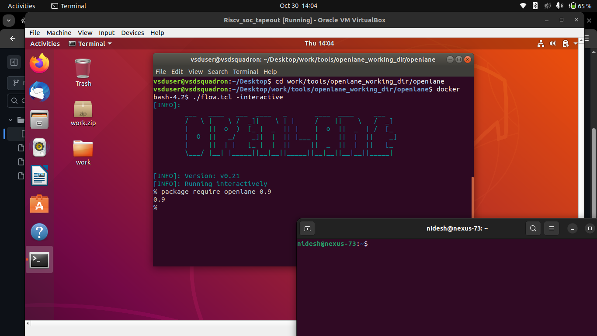
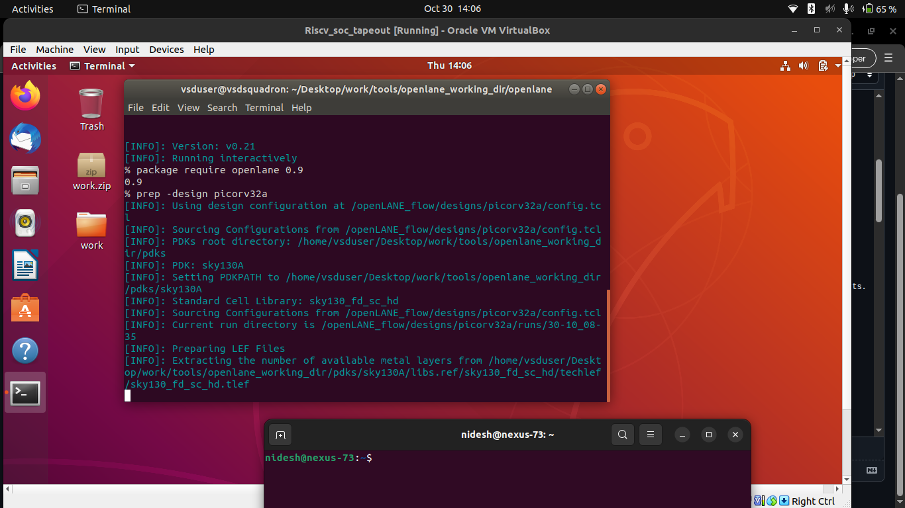
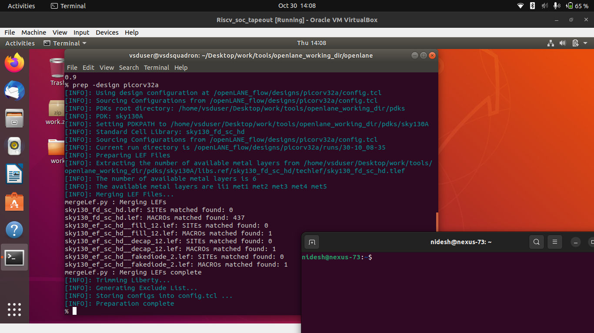
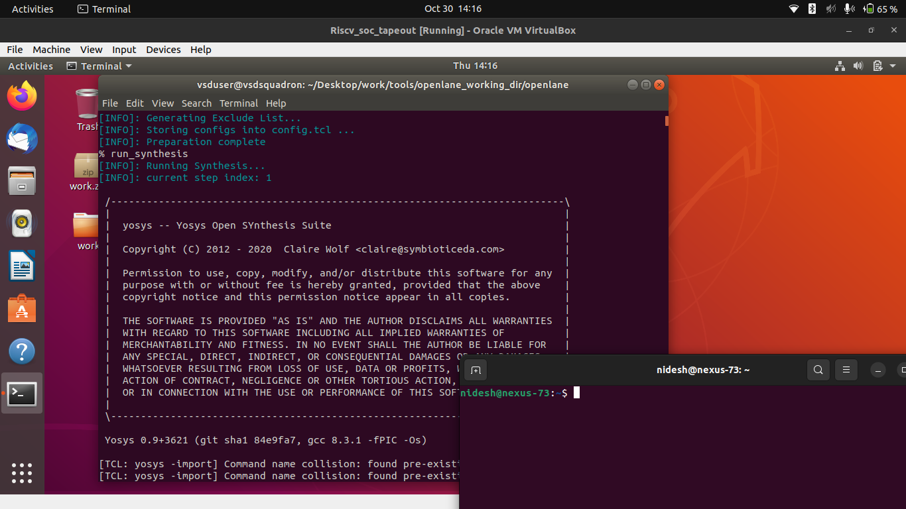
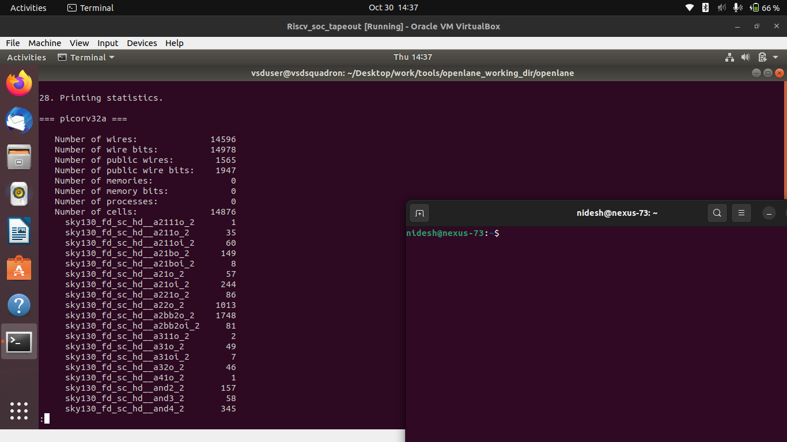

# ⚡ Day 1 — Inception of Open-Source EDA, OpenLANE and Sky130 PDK

### 🧩 RISC-V Reference SoC Tapeout Program – Week 6 (Physical Design Track)

On **Day 1**, I began exploring the foundation of **open-source digital ASIC design** using the **SkyWater 130 nm PDK** and the **OpenLANE flow**.
The goal was to understand how the open EDA ecosystem enables the full **RTL-to-GDSII** process.

---

## 🧭 1. Exploring OpenLANE and PDK Setup

To start, I launched the OpenLANE Docker environment and verified the PDK setup.

```bash
cd ~/work/tools/openlane_working_dir/openlane
docker
./flow.tcl -interactive
package require openlane 0.9
```



---

## ⚙️ 2. Design Preparation

I prepared the reference design (`picorv32a`) which initializes the configuration files and working directories.

```bash
prep -design picorv32a
```



The `prep` command creates the working directory under `designs/picorv32a/runs/`, containing synthesis and placement reports.

---

## 🧩 3. Running Synthesis

Next, I ran synthesis using Yosys, which converts the RTL description into a gate-level netlist.

```bash
run_synthesis
```



After completion, I reviewed the synthesis report:

```bash
less runs/30-10_08-35/reports/synthesis/1-yosys_4.stat.rpt
```

**Screenshot Placeholder:**





---

## 📈 4. Analyzing Synthesis Reports

The Yosys stat file provides details like cell count, logic area, and flip-flop usage.

Example computation:

$[
Flop\ Ratio = \frac{Number\ of\ DFFs}{Total\ Cells} = \frac{1613}{14876} = 0.1084,(10.84%)
]$


---

## 🧮 5. Key Commands Used Today

| **Command**                                 | **Purpose**                           |
| ------------------------------------------- | ------------------------------------- |
| `docker`                                    | Launch OpenLANE interactive container |
| `./flow.tcl -interactive`                   | Run OpenLANE in interactive mode      |
| `package require openlane 0.9`              | Load OpenLANE Tcl package             |
| `prep -design picorv32a`                    | Prepare the design for flow           |
| `run_synthesis`                             | Perform logic synthesis using Yosys   |
| `less runs/30-10_08-35/reports/synthesis/1-yosys_4.stat.rpt` | View synthesis summary report         |

---

## 📚 Summary

On **Day 1**, I successfully launched the **OpenLANE environment**, prepared the **picorv32a design**, and ran the **synthesis stage** with Yosys.
The session provided a hands-on understanding of how Verilog RTL is transformed into a **gate-level netlist** within the Sky130 PDK context.
This foundational setup paves the way for **floorplanning, placement, and routing** in the upcoming days.

---

