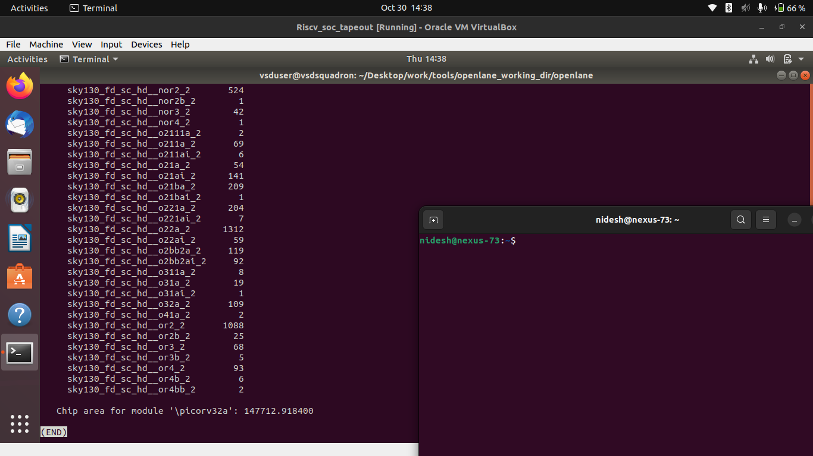

# ⚡ Day 1 — Inception of Open-Source EDA, OpenLANE and Sky130 PDK

### 🧩 RISC-V Reference SoC Tapeout Program – Week 6 (Physical Design Track)

---

## 🧠 THEORY

On **Day 1**, I began exploring the **foundation of open-source digital ASIC design**, where hardware description languages meet silicon fabrication.
This session focused on understanding the **OpenLANE flow**, **SkyWater 130 nm PDK**, and the **end-to-end RTL-to-GDSII design process**.

---

### 🔍 1. What is an ASIC Design Flow?

An **Application-Specific Integrated Circuit (ASIC)** is a custom-built chip designed for a specific task.
The design flow converts a high-level hardware description (RTL code) into the **GDSII** layout file used for fabrication.
This transformation is known as the **RTL-to-GDSII flow**, consisting of:

| **Stage**     | **Purpose**                           |
| ------------- | ------------------------------------- |
| RTL Design    | Describe circuit behavior in Verilog  |
| Synthesis     | Convert RTL into gate-level logic     |
| Floorplanning | Define die area and power grid        |
| Placement     | Arrange standard cells physically     |
| CTS           | Build the clock distribution network  |
| Routing       | Connect nets using metal layers       |
| Sign-off      | Verify design rules and timing        |
| GDSII Export  | Generate final layout for fabrication |

---

### 🧩 2. Open-Source EDA Ecosystem

Traditionally, ASIC design relied on commercial tools like Cadence or Synopsys.
However, open-source projects have made silicon design accessible to everyone through collaborative innovation.

| **Stage**                           | **Open-Source Tool**       |
| ----------------------------------- | -------------------------- |
| Logic Synthesis                     | **Yosys**                  |
| Floorplanning / Placement / Routing | **OpenROAD / TritonRoute** |
| Clock Tree Synthesis                | **TritonCTS**              |
| DRC / LVS Verification              | **Magic**, **Netgen**      |
| Layout Visualization                | **KLayout**                |
| Timing Analysis                     | **OpenSTA**                |

These tools are seamlessly integrated under one automated flow — **OpenLANE**.

---

### 🏗️ 3. OpenLANE Overview

**OpenLANE** is an open-source RTL-to-GDSII flow built around the **SkyWater 130 nm PDK**.
It automates each design step using Tcl scripts and Docker, ensuring a reproducible and portable environment.

**Key Features**

* Fully automated flow from RTL to GDSII
* Modular step-by-step execution (`run_synthesis`, `run_floorplan`, etc.)
* Integrated timing, power, and physical verification
* Compatible with multiple standard cell libraries (HD, HS, LL, etc.)

---

### ⚙️ 4. SkyWater 130 nm PDK (Sky130)

The **SkyWater 130 PDK** is the first open-source Process Design Kit, jointly released by Google and SkyWater Technology Foundry.
It contains:

* Design rules (DRC/LVS parameters)
* Device models (NMOS, PMOS transistors)
* Standard cell libraries (`sky130_fd_sc_hd`, `sky130_fd_sc_hs`, etc.)
* Layer definitions and process information

This PDK bridges the software (EDA tools) and hardware (fabrication) worlds.

---

### 🧮 5. Role of Synthesis

**Synthesis** is the first transformation in the physical design journey.
It converts Verilog RTL into a **gate-level netlist**, mapping logic to technology-specific standard cells.

It provides:

* **Cell Count** – Total standard cells used
* **Area Estimation** – Logic size before layout
* **Flip-Flop Ratio** – Sequential vs combinational density

This stage defines the logical complexity of the design before moving into floorplanning.

---

### 📊 Conceptual Flow Diagram

*(Placeholder for conceptual diagram showing RTL → Synthesis → Floorplan → Placement → CTS → Routing → GDSII)*


---

## 🧭 PRACTICAL IMPLEMENTATION

### 🧭 1. Exploring OpenLANE and PDK Setup

To start, I launched the OpenLANE Docker environment and verified the PDK setup.

```bash
cd ~/work/tools/openlane_working_dir/openlane
docker
./flow.tcl -interactive
package require openlane 0.9
```


---

### ⚙️ 2. Design Preparation

I prepared the reference design (`picorv32a`) which initializes configuration files and working directories.

```bash
prep -design picorv32a
```


The `prep` command creates the working directory under
`designs/picorv32a/runs/`, containing synthesis and placement reports.

---

### 🧩 3. Running Synthesis

Next, I ran synthesis using **Yosys**, which converts the RTL description into a gate-level netlist.

```bash
run_synthesis
```


After completion, I reviewed the synthesis report:

```bash
less runs/30-10_08-35/reports/synthesis/1-yosys_4.stat.rpt
```




---

### 📈 4. Analyzing Synthesis Reports

The **Yosys stat file** provides details like cell count, logic area, and flip-flop usage.

Example computation:

$[
Flop\ Ratio = \frac{Number\ of\ DFFs}{Total\ Cells} = \frac{1613}{14876} = 0.1084,(10.84%)
]$


*Figure: Flop ratio calculated from Yosys synthesis report.*

---

### 🧮 5. Key Commands Used Today

| **Command**                                                  | **Purpose**                           |
| ------------------------------------------------------------ | ------------------------------------- |
| `docker`                                                     | Launch OpenLANE interactive container |
| `./flow.tcl -interactive`                                    | Run OpenLANE in interactive mode      |
| `package require openlane 0.9`                               | Load OpenLANE Tcl package             |
| `prep -design picorv32a`                                     | Prepare the design for flow           |
| `run_synthesis`                                              | Perform logic synthesis using Yosys   |
| `less runs/30-10_08-35/reports/synthesis/1-yosys_4.stat.rpt` | View synthesis summary report         |

---

## 📚 SUMMARY

On **Day 1**, I explored the **OpenLANE environment** and the **Sky130 PDK**, understanding how open-source EDA tools enable a complete RTL-to-GDSII flow.
I successfully prepared the **picorv32a** reference design and executed the **synthesis stage**, analyzing the **Yosys reports** to derive the **flop ratio** and logic composition.

This established a strong foundation for the next stages — **floorplanning, placement, clock-tree synthesis, and routing** — in the upcoming days.

---
