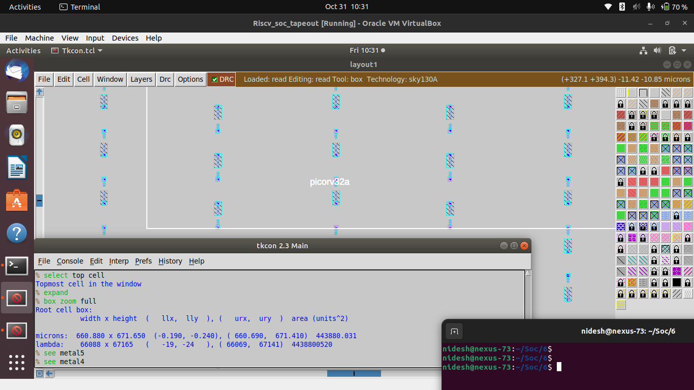
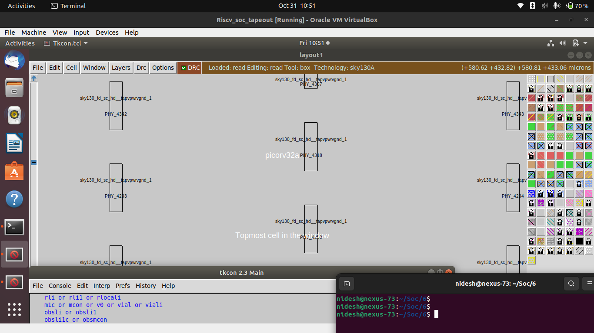
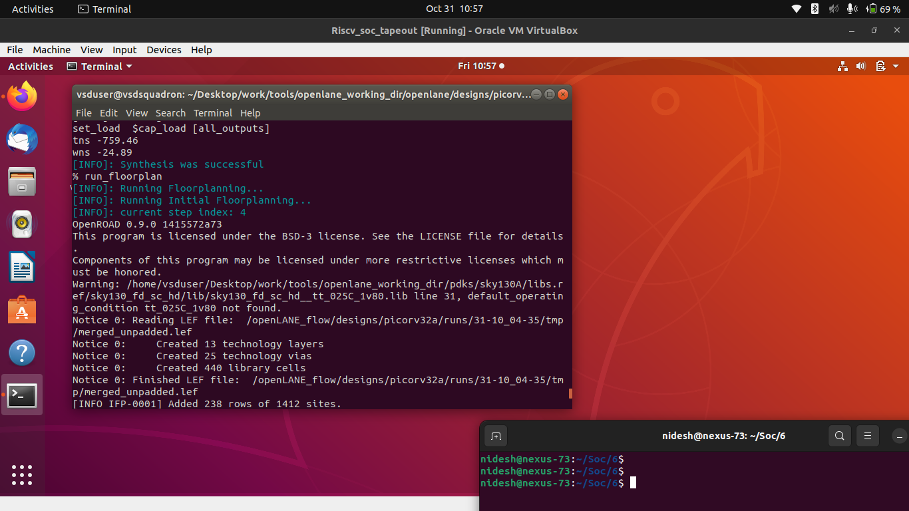
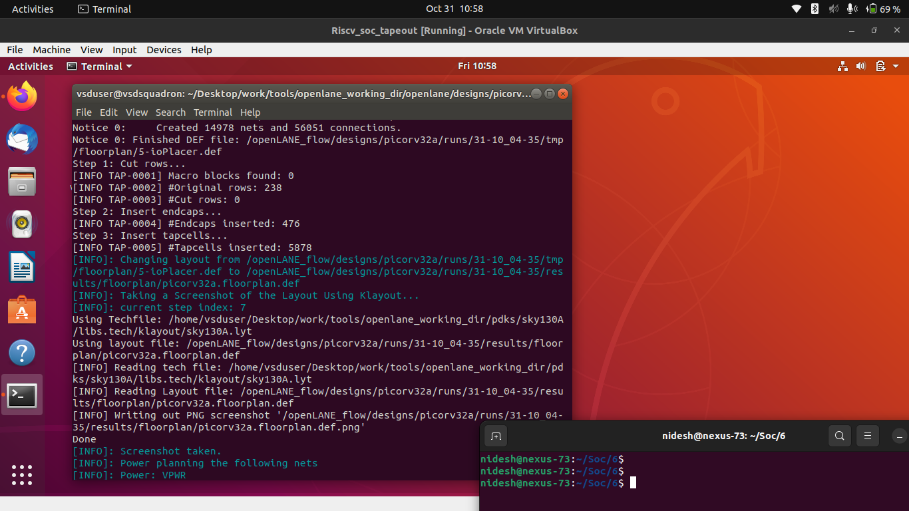
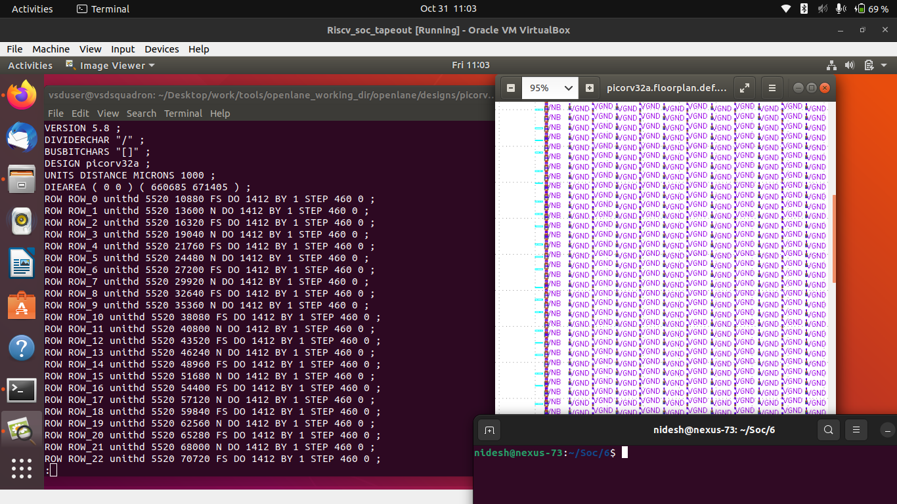
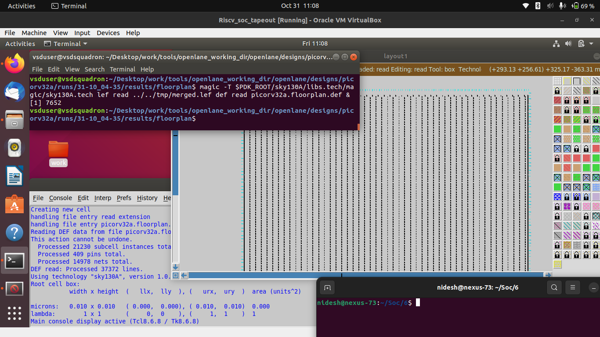
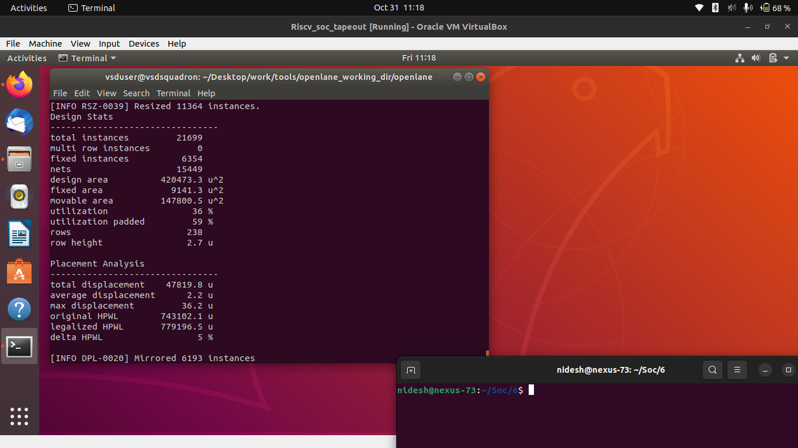
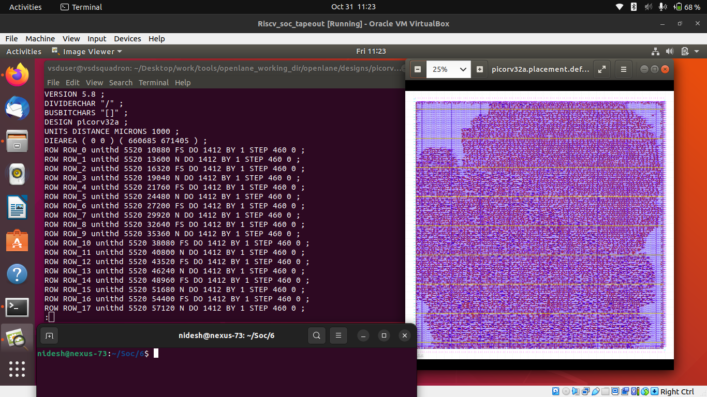
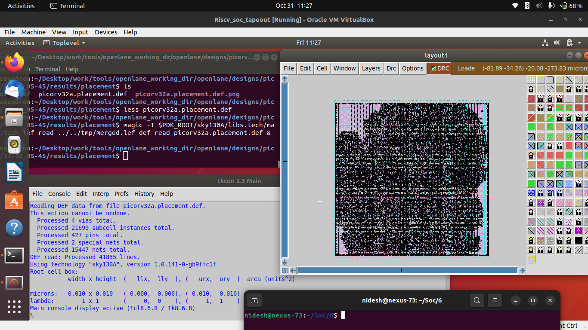

# ⚙️ Day 2 — Good Floorplan vs Bad Floorplan & Introduction to Library Cells

## 🧩 RISC-V Reference SoC Tapeout Program

Welcome to **Day 2** of the **RISC-V SoC Tapeout Program**, where we explore one of the most crucial physical-design stages — **chip floorplanning** and **standard-cell characterization**.

This day builds on the synthesized netlist generated in **Day 1** and focuses on how cells, pins, and power networks are **arranged and optimized** on silicon to achieve design closure.

---

## 🧱 1. Chip Floorplanning

### 🔹 Definition

Chip floorplanning is the process of arranging **macros, standard cells, and I/O pins** within the chip core area. It ensures proper connectivity, minimizes routing congestion, and establishes a balanced power distribution across the die.

### 🔹 Key Metrics

#### ➤ Utilization Factor

$[Utilization\ Factor = \frac{Area\ used\ by\ Standard\ Cells}{Total\ Core\ Area}]$

Typical range: **0.5 – 0.7 (50 – 70 %)**
A good utilization factor leaves sufficient whitespace for routing and clock-tree insertion.

#### ➤ Aspect Ratio

$[Aspect\ Ratio = \frac{Height}{Width}]$

A square-like core (aspect ratio ≈ 1) helps achieve uniform routing and power balance.

---

## ⚡ 2. Power Planning

Power planning defines **VDD/VSS grid structures** that distribute power evenly across the die and reduce **IR drop** & **ground bounce**.
By minimizing voltage variation, cells maintain consistent switching speed and noise immunity.



---

## 📍 3. Pin Placement

Pin placement affects signal delay, buffer insertion, and congestion.
Common strategies include:

* **Equidistant Placement** – pins distributed evenly along edges.
* **High-Density Placement** – grouping pins to shorten interconnects for specific blocks.



---

## 🧭 4. Floorplanning in OpenLANE

### 🧰 Command Flow

```bash
# Enter OpenLANE docker
docker

# Inside interactive mode
./flow.tcl -interactive
package require openlane 0.9
prep -design picorv32a
run_synthesis
run_floorplan
```

This generates the **floorplan DEF file**, which contains die area, core dimensions, pin locations, and power grid layout.

---

### 📊 Output Example

```
[INFO]: Running Floorplan...
[STEP 1]: Reading config.tcl
[STEP 2]: Creating Core Area
[STEP 3]: Inserting Tapcells & Decaps
[STEP 4]: Generating pin placement
[INFO]: Floorplan completed successfully.
```





---

### 📏 Die Area Calculation

From `picorv32a.floorplan.def` :

```
DIEAREA ( 0 0 ) ( 660685 671405 )
1000 unit distance = 1 micron
```

**Die Width** = 660685 / 1000 = 660.685 μm  
**Die Height** = 671405 / 1000 = 671.405 μm  
**Area** = 660.685 × 671.405 = 443,587.21 μm²




---

## 🧩 5. Visualizing Floorplan in Magic

To view the floorplan:

```bash
cd ~/Desktop/work/tools/openlane_working_dir/openlane/designs/picorv32a/runs/<run_dir>/results/floorplan/
magic -T $PDK_ROOT/sky130A/libs.tech/magic/sky130A.tech \
      lef read ../../tmp/merged.lef \
      def read picorv32a.floorplan.def &
```

**Required Files**

1. `sky130A.tech` – Technology file
2. `merged.lef` – Physical library information
3. `picorv32a.floorplan.def` – Generated layout




---

## 🧮 6. Placement Stage

### 📌 Purpose

Placement determines the **exact locations of standard cells** within the core region to optimize **timing, congestion, and area**.

It occurs in two phases:

* **Global Placement:** Rough cell positioning based on timing and connectivity.
* **Detailed Placement:** Legalizes cell positions to avoid overlaps and minimize wire length.

### 🔧 Command Execution

```tcl
run_placement
```





---

### 🔍 Inspect Placement in Magic

```bash
cd ~/Desktop/work/tools/openlane_working_dir/openlane/designs/picorv32a/runs/<run_dir>/results/placement/
magic -T $PDK_ROOT/sky130A/libs.tech/magic/sky130A.tech \
      lef read ../../tmp/merged.lef \
      def read picorv32a.placement.def &
```



---

## 🧠 7. Cell Design and Characterization Flows

### 🔸 Cell Design Flow

Cell design involves **schematic creation**, **layout design**, and **DRC/LVS verification**.
Each standard cell is designed once and reused during synthesis and placement.


---

### 🔸 Characterization Flow

Characterization converts the transistor-level design into **timing, power, and functional models** for use by synthesis and STA tools.

**Stages in Characterization Flow:**

1. Netlist Extraction
2. Specification of Parameters
3. Model Selection
4. SPICE Simulations & Measurement
5. Model Generation
6. Verification


---

## ✅ 8. Summary

| Step | Task                                    | Tool         | Output                    |
| ---- | --------------------------------------- | ------------ | ------------------------- |
| 1    | Run floorplan                           | OpenLANE     | `picorv32a.floorplan.def` |
| 2    | Calculate die area                      | DEF Analysis | 443,587 μm²               |
| 3    | Visualize floorplan                     | Magic        | Die & Pins Layout         |
| 4    | Run placement                           | OpenLANE     | `picorv32a.placement.def` |
| 5    | Visualize placement                     | Magic        | Standard Cell Grid        |
| 6    | Review cell design and characterization | Conceptual   | Flow Diagrams             |

---

### 🧾 Commands to Exit

```tcl
exit  ;# Exit OpenLANE
exit  ;# Exit Docker
```

---

### 🧠 **Summary Table — Day 2 Key Concepts**

| Concept                               | Key Takeaway                                                                               |
| ------------------------------------- | ------------------------------------------------------------------------------------------ |
| **Chip Floorplanning**                | Defines placement of blocks, pins, and macros to optimize area and timing                  |
| **Utilization & Aspect Ratio**        | Balances core area usage (typically 50–70%) to ease placement & routing                    |
| **Power Planning**                    | Builds uniform power grid to prevent IR drop and ground bounce                             |
| **Pin Placement**                     | Strategic pin positioning minimizes delay and buffer count                                 |
| **Floorplan & Placement in OpenLANE** | Commands `run_floorplan` and `run_placement` generate DEF files for visualization in Magic |
| **Library Cell Design Flow**          | Shows stages of standard-cell creation—from schematic to layout and GDS II                 |
| **Characterization Flow**             | Models delay, power, and timing constraints for cell-level optimization                    |

---

## 🔗 **Next Step**

➡️ Proceed to **[Day 3 — Design Library Cell using Magic Layout and ngspice Characterization](../Day3_Design_LibraryCell_Magic_ngspice/readme.md)**

Here, you’ll **design your own standard cell** (like a CMOS inverter), create its **layout in Magic**, perform **DRC/LVS checks**, extract its **SPICE netlist**, and run **ngspice simulations** to measure **delay, rise/fall times, and power**—building the foundation for custom cell libraries.

---
