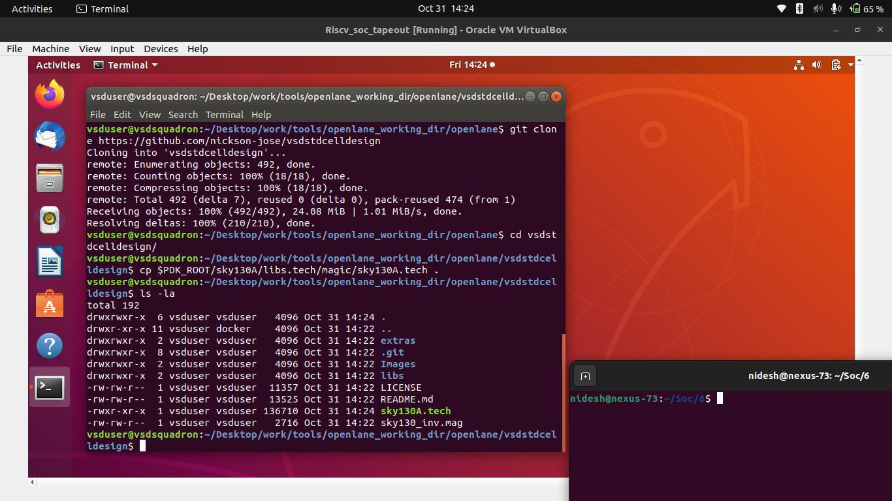
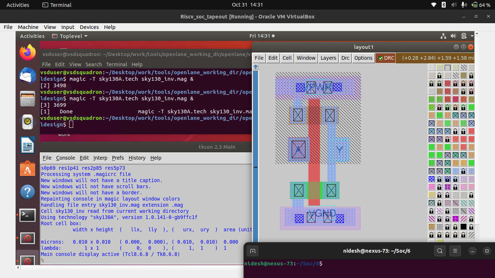
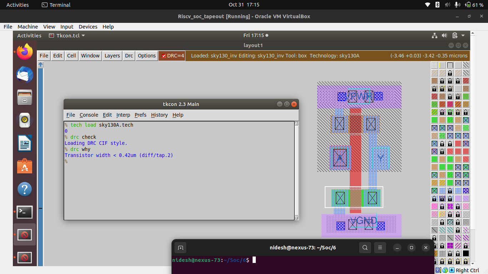
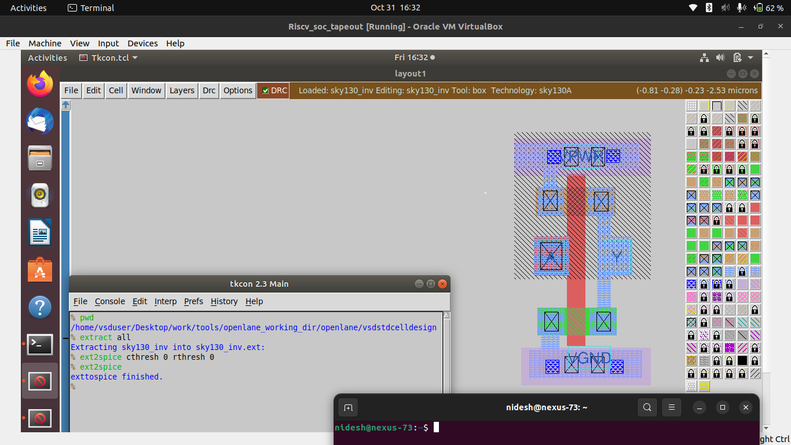
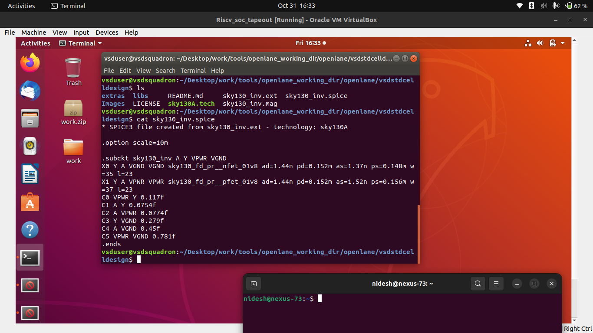
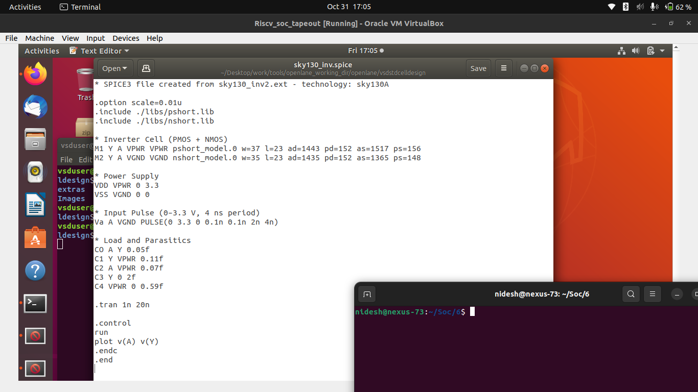
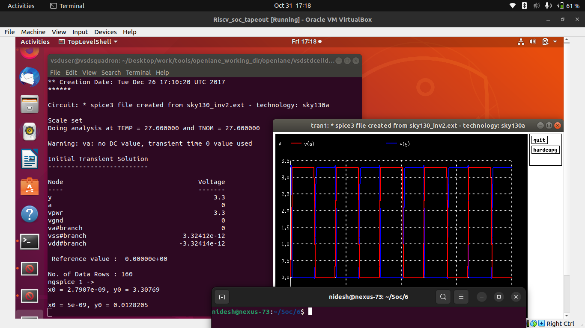
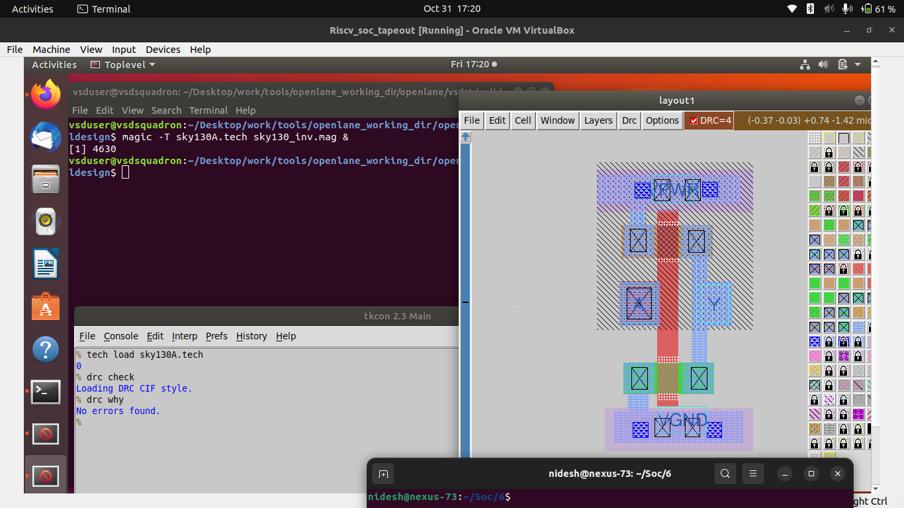

# ⚙️ Day 3 — Design Library Cell using Magic Layout and NGSPICE Characterization

## 🧩 RISC-V Reference SoC Tapeout Program — Week 6

Welcome to **Day 3** of **Week 6** in the RISC-V SoC Tapeout Program.
In this session, we move from pre-characterized library usage to **custom standard-cell design** — creating and analyzing a **CMOS inverter** using the **Magic Layout Tool** and **NGSPICE simulation**.

This hands-on flow forms the foundation for developing reusable, characterized cells that can be integrated into any ASIC design library.

---

## 🧱 1. Overview — Standard Cell Design Flow

Every standard cell (like an inverter, NAND, NOR, etc.) undergoes a **complete design and verification cycle** before it becomes part of the library.

| Step | Stage              | Tool    | Output                    |
| ---- | ------------------ | ------- | ------------------------- |
| 1    | Layout Design      | Magic   | `.mag` file               |
| 2    | DRC Verification   | Magic   | DRC clean layout          |
| 3    | Netlist Extraction | Magic   | `.ext` and `.spice` files |
| 4    | Simulation         | NGSPICE | Transient output waveform |
| 5    | Re-verification    | Magic   | Final DRC check = clean   |

---

## 🧩 2. Repository Setup and Tech File Configuration

To begin, clone the inverter design repository, copy the Sky130 PDK technology file, and verify the setup.

### 🔧 Commands

```bash
# Change directory to OpenLANE environment
cd Desktop/work/tools/openlane_working_dir/openlane

# Clone the repository with custom inverter design
git clone https://github.com/nickson-jose/vsdstdcelldesign

# Change into repository directory
cd vsdstdcelldesign

# Copy magic tech file to the repo directory for easy access
cp /home/vsduser/Desktop/work/tools/openlane_working_dir/pdks/sky130A/libs.tech/magic/sky130A.tech .

# Check contents to ensure everything is present
ls -la
```



---

## 🧮 3. Opening the Inverter Layout in Magic

Next, open the provided **inverter layout file** (`sky130_inv.mag`) using the Magic VLSI Layout Editor.

### 🔧 Command

```bash
magic -T sky130A.tech sky130_inv.mag &
```



---

## ⚠️ 4. Design Rule Check (DRC) — Identifying Layout Violations

Magic provides an integrated **Design Rule Check (DRC)** engine that verifies layout geometry against the **Sky130A process rules**.

### 🔧 Commands

```tcl
% tech load sky130A.tech
0
% drc check
Loading DRC CIF style.
% drc why
Transistor width < 0.42um (diff/tap.2)
```



---

## ⚗️ 5. SPICE Netlist Extraction from Magic

Once the layout is analyzed, the next step is to **extract the SPICE netlist** from the Magic design for simulation.
This process converts the physical geometry into its equivalent electrical representation.

### 🔧 Commands

```tcl
# Extract device and connectivity information into .ext format
extract all

# Enable parasitic extraction and convert to SPICE netlist
ext2spice cthresh 0 rthresh 0

# Generate final SPICE file
ext2spice
```



---

## 🧾 6. Generated SPICE Netlist

After running `ext2spice`, the file `sky130_inv.spice` is generated.
This file contains transistor instances, connections, and parasitic elements.

📄 **Generated File:** `sky130_inv.spice`



---

## ✍️ 7. Modifying SPICE for Transient Simulation

To simulate the inverter’s performance, we modify the generated SPICE file by adding voltage sources, input pulse, and transient analysis commands.

### 📘 **Modified SPICE File**

```spice
* SPICE3 file created from sky130_inv2.ext - technology: sky130A

.option scale=0.01u
.include libs/pshort.lib
.include libs/nshort.lib 

M1000 Y A VPWR VPWR pshort_model.0 w=37 l=23
+ ad=1443 pd=152 as=1517 ps=156
M1001 Y A VGND VGND nshort_model.0 w=35 l=23
+ ad=1435 pd=152 as=1365 ps=148

VDD VPWR 0 3.3V
VSS VGND 0 0V
Va A VGND PULSE(0V 3.3V 0 0.1ns 0.1ns 2ns 4ns)

CO A Y 0.05fF
C1 Y VPWR 0.11fF
C2 A VPWR 0.07fF
C3 Y 0 2fF
C4 VPWR 0 0.59fF

.tran 1n 20n

.control
run
.endc
.end
```



---

## ⚡ 8. Transient Simulation using NGSPICE

Run the transient simulation using **NGSPICE** to observe the inverter’s switching behavior.

### 🔧 Commands

```bash
# Run NGSPICE simulation
ngspice sky130_inv.spice
```

### 🧩 Plot the Output Waveform

```bash
ngspice 1 -> plot Y vs time A
```

The plot shows the **input (A)** and **output (Y)** waveforms over time.
We can measure:

* **Rise Time (t_r)**
* **Fall Time (t_f)**
* **Propagation Delay (t_pHL / t_pLH)**



---

## ✅ 9. Re-Verification — DRC Clean Layout

After correcting the layout and regenerating the SPICE netlist, rerun DRC in Magic.
This time, all violations are cleared, confirming a **DRC-clean standard cell**.

### 🔧 Commands

```tcl
% tech load sky130A.tech
0
% drc check
Loading DRC CIF style.
% drc why
No errors found.
%
```



---

## 🧠 10. Concept Recap — Design Flow Summary

| Stage | Description                  | Tool        | Output                   |
| ----- | ---------------------------- | ----------- | ------------------------ |
| 1     | Clone repo & setup tech file | Git, Shell  | `sky130A.tech` ready     |
| 2     | Open layout                  | Magic       | `sky130_inv.mag`         |
| 3     | Run DRC check                | Magic       | Initial violations found |
| 4     | Extract SPICE netlist        | Magic       | `sky130_inv.spice`       |
| 5     | Edit netlist                 | Text Editor | Transient-ready SPICE    |
| 6     | Run simulation               | NGSPICE     | Waveform plots           |
| 7     | Re-run DRC                   | Magic       | DRC Clean Layout         |

---

## 🔍 11. Key Learnings

| Concept                     | Description                                                                    |
| --------------------------- | ------------------------------------------------------------------------------ |
| **Magic Layout Tool**       | Open-source VLSI layout editor supporting DRC, extraction, and PDK integration |
| **Design Rule Check (DRC)** | Ensures physical geometries meet foundry design limits                         |
| **SPICE Extraction**        | Converts physical layout into electrical equivalent netlist                    |
| **NGSPICE Simulation**      | Performs circuit-level transient and DC analysis                               |
| **Delay Characterization**  | Extracts rise/fall time and propagation delay for timing libraries             |

---

## 🧩 12. Conclusion

This day established the **foundation for standard-cell design and characterization** using open-source tools.
You successfully:

* Created and analyzed a CMOS inverter layout,
* Extracted its SPICE netlist,
* Simulated its electrical behavior, and
* Achieved a **DRC-clean layout** ready for inclusion in a cell library.

---

### 🔗 **Next Step**

➡️ Proceed to **[Day 4 — LVS (Layout vs Schematic) and Parasitic Extraction](../Day4_LVS_Parasitics/readme.md)**
You’ll verify **layout-to-schematic consistency** and learn how parasitic RC values influence circuit timing and power.

---
