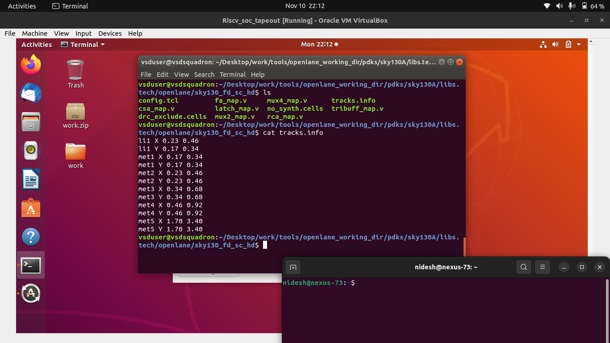

# ⏱️ Day 4 — Pre-Layout Timing Analysis and Importance of a Good Clock Tree

## 🧩 RISC-V Reference SoC Tapeout Program — Week 6

Welcome to **Day 4** of **Week 6** in the RISC-V SoC Tapeout Program.
In this session, you will move beyond cell-level design into **timing modeling**, **clock tree synthesis**, and **static timing analysis (STA)** using **OpenSTA** and **TritonCTS** — two core engines in the **OpenLANE RTL-to-GDS flow**.

This stage ensures your design not only functions logically but also meets **timing closure** requirements before fabrication.

---

## 🧱 1. Overview — Why Timing Analysis and Clock Trees Matter

Every digital circuit’s correctness depends not only on logic but also on **timing**.
Even a functionally correct design can fail in silicon if setup or hold times are violated.

| Concept                            | Description                                               |
| ---------------------------------- | --------------------------------------------------------- |
| **Setup Time (t<sub>setup</sub>)** | Minimum time data must be stable **before** clock edge    |
| **Hold Time (t<sub>hold</sub>)**   | Minimum time data must remain stable **after** clock edge |
| **Clock Skew**                     | Difference in clock arrival time at two flip-flops        |
| **Clock Jitter**                   | Variation in clock edge due to noise or uncertainty       |

A **good clock tree** ensures minimal skew and balanced distribution of the clock signal across the chip.

---

## ⚙️ 2. Converting Layout to LEF — Standard Cell Integration

Before using a custom cell (like our inverter) in synthesis, it must be abstracted into a **Library Exchange Format (LEF)** file.
The LEF contains **physical boundaries, pin locations, and routing layers**, but excludes transistor-level details.

### 📘 Track Information Extraction

Every layout is mapped onto the foundry’s **routing grid**.
To align the pins and power rails with the routing tracks, use the `tracks.info` file.

```
<layer-name> <X/Y> <track-offset> <track-pitch>
```

Example:

| Layer | Direction | Offset | Pitch |
| ----- | --------- | ------ | ----- |
| met1  | X         | 0.24   | 0.48  |
| met1  | Y         | 0.16   | 0.34  |



### 📘 Conversion Steps

1. Ensure cell height aligns with **power rails (VPWR/VGND)**.
2. Place pins on track intersections for router visibility.
3. Export the cell to LEF:

```bash
magic -T sky130A.tech sky130_inv.mag
lef write sky130_inv.lef
```


---

## 🧮 3. Timing Libraries — Delay Modeling

For timing analysis, each standard cell must have an associated **.lib (Liberty)** file defining timing arcs and delay tables.

| File Type | Purpose                            |
| --------- | ---------------------------------- |
| `.lib`    | Timing, power, functional behavior |
| `.lef`    | Physical geometry, pin placement   |
| `.mag`    | Layout (Magic format)              |
| `.spice`  | Device-level circuit               |

### ⏱️ Delay Tables

Delays are modeled as 2-D lookup tables based on:

* **Input transition time**
* **Output load capacitance**

Example:

| Slew (ns) → / Load (fF) ↓ | 5    | 10   | 15   |
| ------------------------- | ---- | ---- | ---- |
| 0.05                      | 0.02 | 0.05 | 0.09 |
| 0.10                      | 0.04 | 0.08 | 0.12 |

These tables enable synthesis tools to accurately estimate timing during optimization.


---

## 🧩 4. Timing Analysis using OpenSTA

The **OpenSTA** tool performs **Static Timing Analysis** to verify if all paths meet setup/hold constraints under ideal clock conditions.

### 🔧 Basic Command Flow

```bash
sta config.tcl
```

Inside the `config.tcl`, define:

```tcl
read_liberty sky130_fd_sc_hd__tt_025C_1v80.lib
read_verilog design.v
link_design <top_module>
create_clock -period 10 [get_ports clk]
report_checks -path_delay min_max
```


### 📊 Timing Metrics

| Parameter                      | Description                    |
| ------------------------------ | ------------------------------ |
| **WNS (Worst Negative Slack)** | Most critical timing violation |
| **TNS (Total Negative Slack)** | Sum of all negative slacks     |
| **Setup Slack**                | Margin for setup time          |
| **Hold Slack**                 | Margin for hold time           |

If slack < 0 → timing violation.

---

## 🧭 5. Clock Tree Synthesis (CTS) with TritonCTS

After placement, the clock network is built using **TritonCTS**.
CTS distributes the clock to all sequential elements with minimal skew and balanced delay.

### 🔧 Command

```bash
run_cts
```

This uses an **H-Tree algorithm** to insert clock buffers automatically.


### 📘 Post-CTS Analysis

Re-run timing with the real (buffered) clock tree:

```bash
sta post_cts.conf
```

Observe:

* Reduced skew
* Updated buffer insertion delay
* Realistic setup/hold analysis

---

## ⚡ 6. Common Timing Optimization Techniques

| Issue           | Fix                                                 |
| --------------- | --------------------------------------------------- |
| Setup violation | Increase clock period, upsize buffer, reduce fanout |
| Hold violation  | Add small delay buffers                             |
| Skew imbalance  | Re-run CTS with balanced buffer insertion           |
| High TNS        | Re-synthesize with tighter constraints              |


---

## 🧩 7. Timing Analysis Flow Summary

| Stage        | Tool           | Output                   |
| ------------ | -------------- | ------------------------ |
| Synthesis    | Yosys          | `netlist.v`              |
| Pre-CTS STA  | OpenSTA        | Ideal clock timing       |
| CTS          | TritonCTS      | `cts.def`                |
| Post-CTS STA | OpenSTA        | Real clock timing report |
| Optimization | Yosys/OpenROAD | Slack-fixed design       |

---

## 🧠 8. Key Learnings

| Concept              | Takeaway                                    |
| -------------------- | ------------------------------------------- |
| **LEF abstraction**  | Bridges physical and logical design domains |
| **Timing libraries** | Capture delay and power info for synthesis  |
| **OpenSTA**          | Performs pre- and post-layout static timing |
| **TritonCTS**        | Ensures balanced clock distribution         |
| **Slack metrics**    | Indicate if design meets timing closure     |

---

## ✅ 9. Conclusion

In this day’s session, you:

* Converted a Magic layout into a **standard cell LEF**
* Understood **timing modeling** via delay tables
* Performed **timing analysis** with OpenSTA (ideal clocks)
* Executed **Clock Tree Synthesis** with TritonCTS
* Re-analyzed with **real clocks** for timing closure

Your design is now timing-verified and clock-balanced — ready for **post-layout verification and routing**.

---

### 🔗 **Next Step**

➡️ Proceed to **Day 5 — Final Steps for RTL-to-GDS using TritonRoute and OpenSTA**
Explore how the **detailed routing stage** completes physical implementation and how **post-layout timing verification** ensures sign-off quality results using **OpenSTA**.

---
